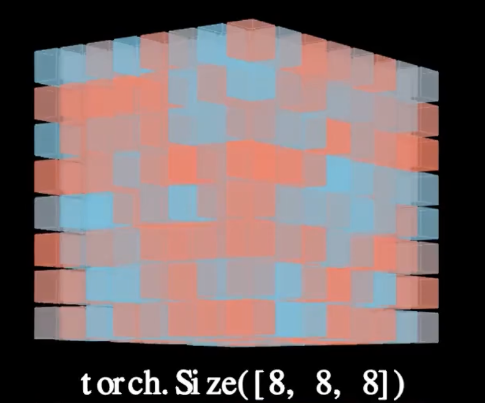
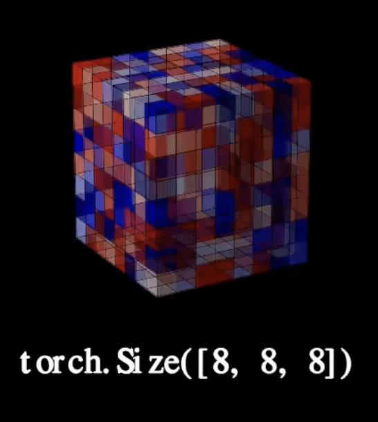
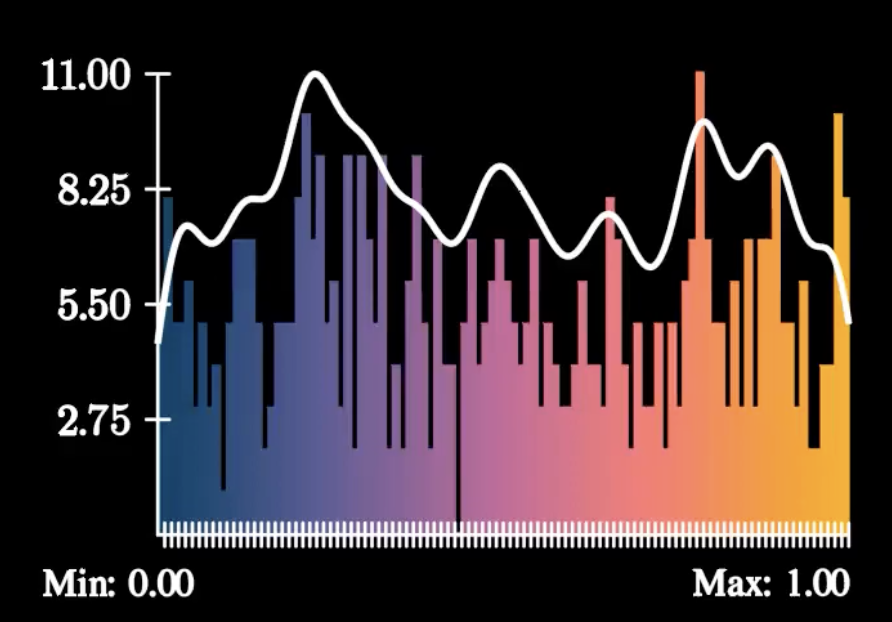
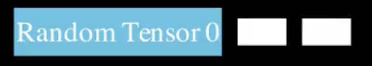

# 3D Tensor Visualization Components
This folder contains a collection of components aimed at visualizing sequences of 3D tensors. These components are categorized into three primary sections: rendering 3D matrices, plotting distributions, and tracking progress over time.

# Components for showing 3D tensors
There are two different classes for rendering 3D matrices:
- native (matrices.py / Matrix3DNative); slower to render
- matplotlib svg (matrices_plt.py / Matrix3DMatplotlib); much faster to render

 Matrix3DNative | Matrix3DMatplotlib
:--------------:|:------------------:
 | 

# Components for plot distributions
- basic (plots.py / create_distribution_plot)

# Components for showing the progress
- basic (progress_bar / make_progress_bar)
