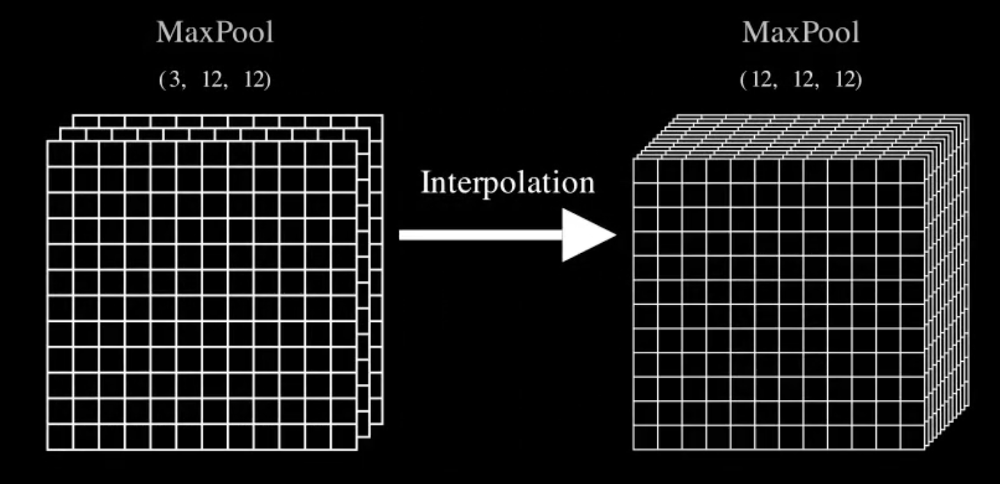
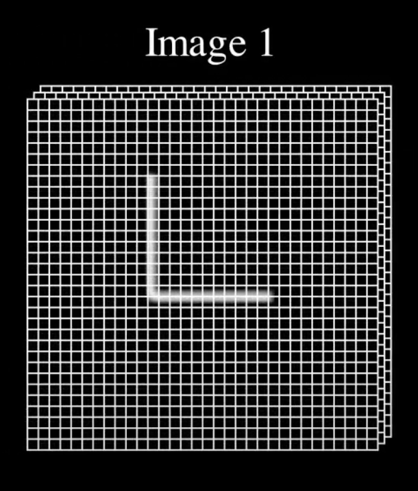
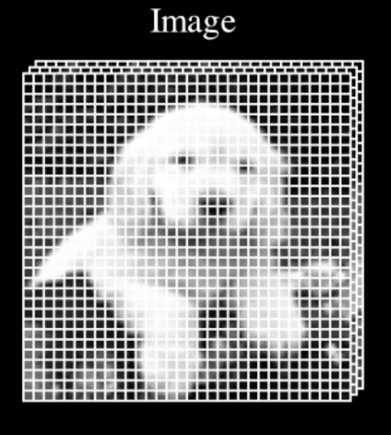

# Matrices Components
This folder contains components for flat matrices. Currently there are two classes - plain flat matrices or image matrices.

# Components for Showing 3D Tensors
|     FlatMatrix3D     |     FlatMatrix3DImage 1      |     FlatMatrix3DImage 2      |
|:--------------------:|:----------------------------:|:----------------------------:|
|  |  |  |